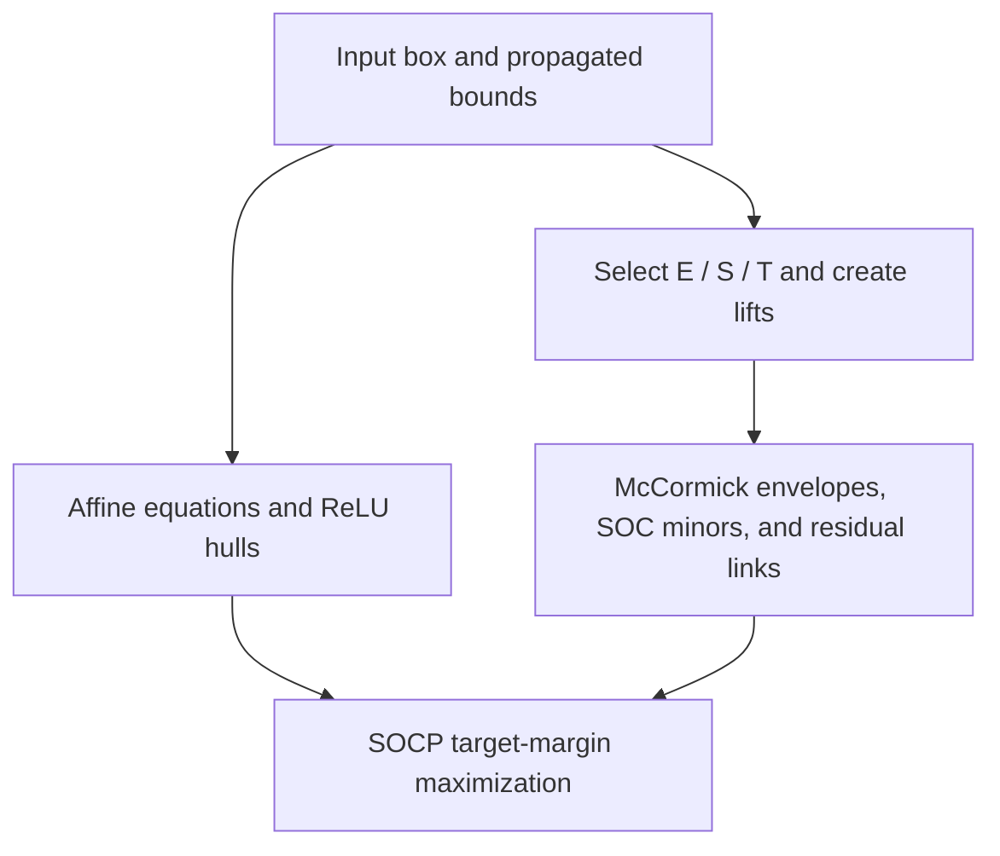

# SOCP Verifier

Sparse second-order cone programming (SOCP) verification for pretrained ReLU
classifiers on **MNIST and CIFAR-10**.

## Research scope

This project studies the tightness and computational cost of convex relaxations
for adversarial robustness certification. Selected lifted products, McCormick
envelopes, and small SOC constraints add coupling information to a scalar ReLU
relaxation. The verifier bounds target-versus-true logit margins over an
L-infinity perturbation region clipped to the valid image range.

This release provides a CVXPY sparse SOCP evaluator for a MNIST MLP, a MNIST
CNN, and a CIFAR-10 CNN5, together with the **Class-Optimized Robust Evaluation
(CORE)** cascade API. CORE evaluates target classes through ordered verifier
stages, stopping a class once a valid negative margin bound is obtained.
Its API is separate from the SOCP evaluation entry point.

Experiment logs and a saved checkpoint are included. The active evaluation
path operates on pretrained models.

[Method](#method-overview) · [Environment](#environment-setup) ·
[Hardware](#experimental-hardware) · [Evaluation](#run-an-evaluation) ·
[Results](#reported-results) · [Repository structure](#repository-structure)

## Method overview

The verifier starts with an input perturbation box, propagated interval bounds,
affine layer equations, and the scalar convex hull of each ReLU. At hidden layer
$k$, let $x$ denote the preceding layer's variables and $z$ the current ReLU
activations. In the first hidden layer, $x$ is the perturbed image.

| Coupling set | Selected product | Relationship |
| --- | --- | --- |
| $\mathcal{E}^{(k)}$ | $x_i z_j$ | Previous-to-current layer. |
| $\mathcal{S}^{(k)}$ | $z_j z_{j'}$ | Two current-layer activations. |
| $\mathcal{T}^{(k)}$ | $x_p x_q$ | Two previous-layer variables. |

For each selected product $w\approx ab$, four **McCormick envelope**
inequalities constrain the lift using the intervals of $a$ and $b$. Square
lifts $d_a$ and $d_b$ are created only when needed and bounded by the square
function and its interval secant. The **second-order cone** constraint

$$
\left\|\begin{bmatrix}2w \\ d_a-d_b\end{bmatrix}\right\|_2
\leq d_a+d_b
$$

enforces positive semidefiniteness of the corresponding $2\times2$ lifted
block. The active solver also links selected $\mathcal{E}$ products to
activation-square lifts through the affine weights and bias, with interval
residuals covering omitted products. These constraints strengthen the ReLU
relaxation while retaining a convex SOCP formulation with sparse lifts.



*Figure 1. Scalar ReLU constraints and sparse product constraints are combined
in one convex program for each input and target class.*

The objective maximizes $f_t(x')-f_y(x')$ over the relaxation. Full multiclass
certification requires valid negative upper bounds for every incorrect class.
See [result interpretation](src/SOCP/README.md#evaluation-behavior-and-metrics).

## Environment setup

The package reference is [`scripts/create_env.sh`](scripts/create_env.sh).

```bash
conda create -n lp-mnist python=3.11 -y
conda activate lp-mnist
python -m pip install --upgrade pip
python -m pip install torch torchvision torchaudio
python -m pip install numpy pyyaml tqdm matplotlib cvxpy scs clarabel
```

For the CUDA 12.4 PyTorch wheel installation recorded in the setup reference,
use this command for the PyTorch installation step:

```bash
python -m pip install torch torchvision torchaudio --index-url https://download.pytorch.org/whl/cu124
```

The evaluator uses PyTorch, torchvision, NumPy, tqdm, CVXPY, SCS, and Clarabel.
The other utility packages are included in the setup reference. Archived
differentiable loss experiments additionally use `cvxpylayers` and `diffcp`.

The setup reference selects Python 3.11 but does not pin other package versions.
Record installed versions with `python -m pip freeze` when reproducing a run.
PyTorch operations use CUDA when available; SCS and Clarabel solve on the CPU.

## Experimental hardware

SOCP and Alpha-Beta-CROWN evaluations used the same machine:

| Component | Specification |
| --- | --- |
| GPU | NVIDIA TITAN Xp |
| GPU memory | 12 GiB |
| System RAM | 15 GiB |

## Run an evaluation

Follow the [MNIST experiment command](src/SOCP/README.md#mnist-experiment-command)
in the SOCP README. Run Python from `src/`. The technical README includes
architecture settings, the full argument reference, and legacy backend
instructions.

The example evaluates a DeepPoly checkpoint trained at epsilon 0.1 with a
verification epsilon of 0.15. Its checkpoint must be provided separately.
The included checkpoint is
[`checkpoints/eps_0.3/crown_IBP_cnn_standard.pt`](checkpoints/eps_0.3/crown_IBP_cnn_standard.pt).

Both loaders in [`src/data.py`](src/data.py) use `ToTensor()` to produce
floating-point inputs in **[0,1]**, without mean/std normalization.
The input box is
`clamp(x - epsilon, 0, 1) <= x' <= clamp(x + epsilon, 0, 1)`.
Checkpoint preprocessing must match this domain.

## Reported results

Accuracy values are percentages. Training method identifies how the checkpoint
was trained. SOCP-cert and Alpha-Beta-CROWN report certified robust accuracy;
PGD reports empirical robust accuracy, an upper bound on true robust accuracy.
Training and verification perturbation budgets are shown separately.

| Dataset | Training method | $\varepsilon_{\mathrm{train}}$ | $\varepsilon_{\mathrm{verify}}$ | Clean | SOCP-cert | $\alpha,\beta$-CROWN | PGD |
| --- | --- | --- | --- | --- | --- | --- | --- |
| MNIST | IBP | 0.1 | 0.1 | 99.00 | 88.33 | 87.33 | 88.67 |
| MNIST | CROWN-IBP | 0.1 | 0.1 | 97.67 | 94.33 | 93.67 | 94.67 |
| MNIST | DeepPoly | 0.1 | 0.1 | 98.00 | 94.67 | 93.33 | 94.67 |
| MNIST | Dual-WK | 0.1 | 0.1 | 82.00 | 69.67 | 70.00 | 72.33 |
| MNIST | CROWN-IBP | 0.1 | 0.15 | 97.67 | 8.00 | N/A | 32.00 |
| MNIST | DeepPoly | 0.1 | 0.15 | 98.00 | 7.33 | N/A | 34.33 |
| MNIST | IBP | 0.3 | 0.3 | 99.00 | 71.67 | 70.33 | 78.33 |
| MNIST | CROWN-IBP | 0.3 | 0.3 | 97.67 | 83.33 | 83.33 | 85.67 |
| MNIST | DeepPoly | 0.3 | 0.3 | 98.00 | 82.33 | 82.00 | 85.67 |
| MNIST | Dual-WK | 0.3 | 0.3 | 82.00 | 51.00 | 48.33 | 51.33 |
| CIFAR-10 | CROWN-IBP | 2/255 | 1/255 | 54.00 | 50.00 | 49.00 | 51.00 |
| CIFAR-10 | DeepPoly | 2/255 | 1/255 | 59.50 | 49.00 | 49.00 | 51.00 |
| CIFAR-10 | Dual-WK | 2/255 | 1/255 | 42.00 | 38.50 | 38.00 | 39.00 |
| CIFAR-10 | CROWN-IBP | 2/255 | 2/255 | 54.00 | 39.50 | 39.50 | 39.50 |
| CIFAR-10 | DeepPoly | 2/255 | 2/255 | 59.50 | 36.50 | 35.50 | 38.00 |
| CIFAR-10 | Dual-WK | 2/255 | 2/255 | 42.00 | 29.00 | 28.50 | 31.50 |

**N/A** indicates that Alpha-Beta-CROWN did not complete the corresponding
evaluation because of the available memory budget.

### Additional MNIST results

| Dataset | Training method | $\varepsilon_{\mathrm{train}}$ | $\varepsilon_{\mathrm{verify}}$ | Clean | SOCP-cert | $\alpha,\beta$-CROWN | PGD |
| --- | --- | --- | --- | --- | --- | --- | --- |
| MNIST | IBP | 0.3 | 0.2 | 99.00 | 83.33 | 81.67 | 86.00 |
| MNIST | CROWN-IBP | 0.3 | 0.2 | 97.67 | 88.33 | 87.33 | 90.00 |
| MNIST | DeepPoly | 0.3 | 0.2 | 98.00 | 88.00 | 86.67 | 90.33 |
| MNIST | Dual-WK | 0.3 | 0.2 | 82.00 | 61.67 | 61.00 | 62.67 |

## Repository structure

| Path | Purpose and contents |
| --- | --- |
| [`Results/`](Results/) | [MNIST SOCP outputs](Results/MNIST_Train_0.3/) and an [AB-CROWN comparison log](Results/AB_Crown%20Results/). |
| [`checkpoints/`](checkpoints/) | Saved model weights, including [`eps_0.3/crown_IBP_cnn_standard.pt`](checkpoints/eps_0.3/crown_IBP_cnn_standard.pt). |
| [`scripts/`](scripts/) | [`create_env.sh`](scripts/create_env.sh), the environment setup reference. |
| [`src/`](src/) | Shared [model builders](src/model.py), [dataset loaders and preprocessing](src/data.py), and bound routines. |
| [`src/SOCP/`](src/SOCP/) | Sparse SOCP verification, certificates, influence scoring, coupling selection, and conic solvers. See the [technical README](src/SOCP/README.md). |
| [`src/CORE/`](src/CORE/) | Class-wise verifier cascade, interfaces, result types, and adapters. See the [CORE README](src/CORE/README.md). |

## Limitations

- The conversion path supports sequential convolution, linear, ReLU, and
  flatten layers.
- The current `certified` flag checks returned margin signs without enforcing
  solver status or complete target coverage. Full multiclass results require
  all incorrect classes and numerical validation; see the
  [interpretation notes](src/SOCP/README.md#evaluation-behavior-and-metrics).
- Dense convolution conversion and CVXPY construction can be expensive.
  [Legacy backend instructions](src/SOCP/README.md#legacy-backend-and-performance)
  describe the fallback and its effect on the relaxation.
